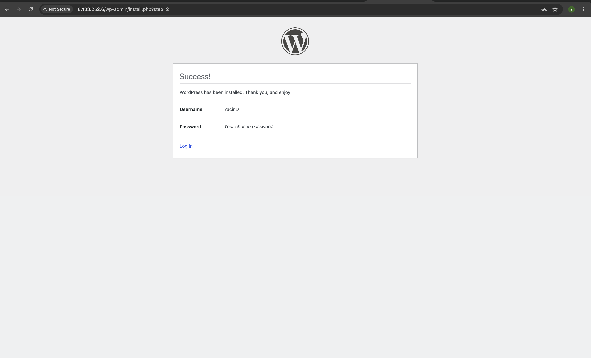

# Terraform WordPress on AWS

A Terraform project that provisions a WordPress environment on AWS using EC2, a Security Group, and automated user data.

## 🚀 Live Deployment

**WordPress:** `http://18.133.252.6`

> ⚠️ **Note:** This is a temporary AWS deployment for a learning assignment. The link may no longer work after the infrastructure is destroyed or the EC2 instance is terminated.

### Working WordPress Installation



---

## 🏗️ Architecture

The infrastructure consists of:

* AWS EC2
* Ubuntu 24.04
* Apache
* MySQL
* PHP
* WordPress
* AWS Security Group
* Terraform user data

---

## 📁 Project Structure

```text
.
├── cloud-init/
├── main.tf
├── variables.tf
├── outputs.tf
├── user-data.sh
├── .gitignore
└── .terraform.lock.hcl
```

| File           | Purpose                                   |
| -------------- | ----------------------------------------- |
| `main.tf`      | AWS provider, EC2, AMI and Security Group |
| `variables.tf` | Terraform variables                       |
| `outputs.tf`   | WordPress IP and URL outputs              |
| `user-data.sh` | Installs and configures WordPress         |
| `cloud-init/`  | Cloud-init configuration                  |
| `.gitignore`   | Protects state and sensitive files        |

---

## ⚙️ How It Works

1. Terraform connects to AWS.
2. An Ubuntu EC2 instance and Security Group are created.
3. User data automatically installs Apache, PHP, MySQL and WordPress.
4. A WordPress database and user are configured.
5. WordPress becomes accessible through the EC2 public IP.

---

## 🛠️ Technologies

Terraform · AWS EC2 · Security Groups · Ubuntu · Apache · MySQL · PHP · WordPress · Bash · Cloud-init

---

## 🚀 Deployment

```bash
terraform init
terraform plan
terraform apply
```

Terraform outputs the WordPress public IP and URL.

To remove the infrastructure:

```bash
terraform destroy
```

---

## 🔐 Security

Sensitive variables such as the database password and Terraform state files are excluded from Git using `.gitignore`.